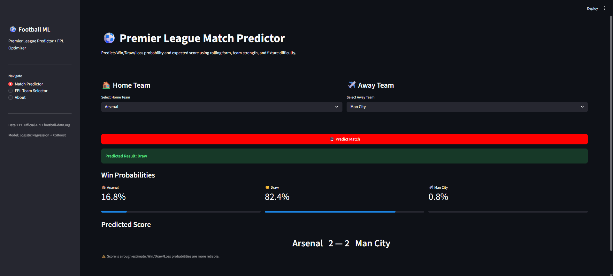
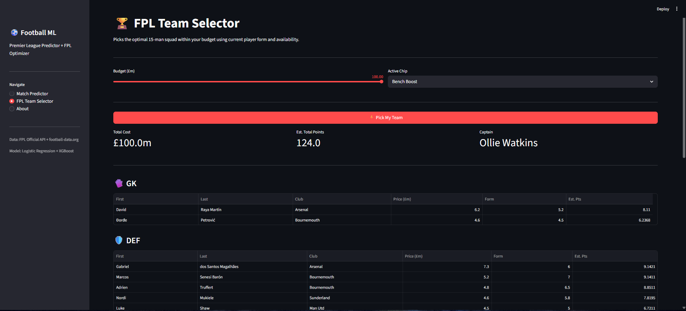
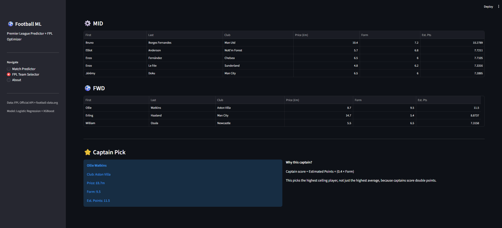

# Football ML Prediction System

> Premier League match predictor + FPL squad optimizer. Built in Python using PostgreSQL, XGBoost, and Streamlit.

**Purav Desai** | B.Tech IT Sem 6, SCET Surat  
[GitHub](https://github.com/PuravDesai004) · [LinkedIn](https://linkedin.com/in/puravdesai41)

---

## Live Demo

*Deploying in Tier 2 — multi-season data + xG/xGA features (July 2026)*

---

## App Screenshots

### Match Predictor
Select any two PL teams and get Win/Draw/Loss probabilities with a predicted scoreline.



### FPL Squad Selection
Optimal 15-man squad under £100m, solved using PuLP linear programming.



### FPL Captain Recommendation
Captain picks ranked by: estimated points + 0.4 × form score.



---

## What This Does

Three prediction systems on one PostgreSQL database, served through a Streamlit frontend:

| System | Predicts | Algorithm |
|--------|----------|-----------|
| **Match Predictor** | Win/Draw/Loss + scoreline | Logistic Regression + XGBoost |
| **League Winner** | Title race probability | Monte Carlo simulation |
| **FPL Optimizer** | Optimal 15-man fantasy squad | XGBoost + PuLP linear programming |

---

## Architecture

```
FPL Official API + football-data.org
           ↓
   Python (requests + pandas)
   Light cleaning + type fixing
           ↓
   PostgreSQL
   7 SQL views — rolling form,
   clean sheet rate, H2H, FDR
           ↓
   scikit-learn + XGBoost
   Time-based train/test split
   5-fold cross-validation
           ↓
   PuLP linear optimizer
   FPL squad selection
           ↓
   Streamlit app (3 pages)
```

---

## Tier 1 Model Results

| Model | CV Accuracy | Test Accuracy |
|-------|-------------|---------------|
| Logistic Regression | 48.6% ± 2.5% | 55.6% |
| XGBoost Classifier | 41.3% ± 3.3% | 51.4% |

| Score Model | MAE | R² |
|-------------|-----|----|
| Home Goals | 1.04 | -0.29 |
| Away Goals | 0.97 | -0.16 |

> One season of data. The negative score R² is expected — it improves in Tier 2 once xG/xGA and multi-season data are in. Win/Draw/Loss probabilities are the reliable output for now; treat exact scores as ballpark figures.

---

## Domain Problems — Identified Before Writing Any Code

These are real football problems I spotted before touching the codebase. Each one has a direct technical response in the architecture.

---

### 1. Style Bias — The Arsenal Problem

Arsenal finishes 2nd for three consecutive seasons with relatively low xG and shot volume. A model trained on goals and shot stats reads them as a weak attacking side.

Their actual value is defensive — no transitions allowed, opponents pushed into low-percentage long shots. None of that shows up in standard stats.

**Fix:** PPDA (Passes Per Defensive Action) + KMeans style clustering groups teams into tactical archetypes. Arsenal gets correctly classified as a Defensive Block, not Weak Attack. The style cluster label feeds into XGBoost as a feature. *(Tier 2)*

---

### 2. Human Behaviour — The Morale Layer

Internal team conflict, player fallouts, personal problems — these create measurable performance drops that no statistical model captures. A squad with active internal beef playing a high-stakes match is fundamentally different from the same squad at full chemistry. Their rolling xG and form numbers look identical.

**Fix:** Morale/Sentiment Layer: `team_morale_score` (-1 to +1), `internal_conflict_flag`, `player_confidence_score`, `rivalry_intensity`, `psychological_block_score`. Short term: manual Streamlit sliders. Medium term: NewsAPI + HuggingFace transformer to infer from match-week news. *(Tier 2)*

---

### 3. Psychological Blocks in H2H Matchups

Man City repeatedly collapse against Real Madrid in UCL knockouts despite being statistically better. PSG choked in the UCL for years before finally winning in 2024-25. These patterns are too consistent across too many years to be noise — they're systematic and should be modeled.

**Fix:** Psychological Block Score: compare a club's win rate in high-stakes matches (QF/SF/Final) against their overall win rate. Reverse logic gives a Tournament Elevation Score for clubs like Real Madrid who consistently outperform their league form in Europe. *(Tier 2)*

---

### 4. Managerial Regime Changes Break Historical Data

Using three years of Chelsea data across four different managers averages across completely incompatible tactical systems. The historical signal turns into noise. Past form under a different manager isn't equally useful, sometimes it's actively misleading.

**Fix:** Manager tenure feature, regime change flag, and exponential decay weighting. Recent matches under the current manager are weighted 1.0; older matches under previous managers decay toward 0.1. Player-level features stay valid across regime changes. *(Tier 2)*

---

### 5. Domestic Performance Doesn't Transfer to UCL

PSG and Bayern dominate their leagues every year but stall at the UCL QF/SF stage. Their pressing works against Ligue 1 and Bundesliga opposition because those defenses are comparatively weaker. Dortmund and Real Madrid punish the same press.

**Fix:** Competition Context Feature: per-club ratio of domestic vs European performance. UCL predictor is intentionally deferred — one season of data is too thin, the format changed in 2024-25, and tournament variance is too high to model reliably right now. *(Tier 3)*

---

### 6. Data Leakage — Caught and Fixed

The original model hit 100% accuracy. That looked good for about five minutes until I realized the H2H features were calculated from the same season's matches that were being predicted — the model already had the answers baked in. In production with future fixtures, those features wouldn't exist.

**Fix:** H2H features removed until multi-season data is available in Tier 3. Random split replaced with a time-based split: train on GW3–GW31, test on GW31–GW38. Honest accuracy: 55.6%.

---

### 7. Small Dataset — Data Problem, Not Compute Problem

One PL season gives 360 usable rows after cleaning. GPU acceleration doesn't help here.

**Fix:** Switch to player-level rows: 3,800 matches expand to 83,000+ rows. Multi-league data in Tier 3: 5 leagues gives 400,000+ rows. FPL data: 38 GWs × 500 players × 5 seasons = 95,000 rows. *(Tier 3)*

---

## Tech Stack

| Layer | Technology |
|-------|-----------|
| Language | Python |
| Database | PostgreSQL (local) → Supabase (production) |
| ML Models | scikit-learn, XGBoost |
| Optimizer | PuLP (linear programming) |
| Frontend | Streamlit |
| Deployment | Streamlit Cloud + Supabase *(Tier 2)* |
| Model saving | joblib |
| Data sources | FPL Official API, football-data.org |

---

## Project Structure

```
Football Predictor Model/
├── data/
│   ├── raw/                    ← raw JSON from APIs (gitignored)
│   ├── processed/
│   └── exports/
├── src/
│   ├── data_pipeline.py        ← API fetch + PostgreSQL storage
│   ├── feature_engineering.py  ← 7 SQL views + feature loading
│   ├── train_model.py          ← model training + match prediction
│   └── fpl_optimizer.py        ← PuLP optimizer + captain logic
├── models/saved/               ← .pkl files (gitignored)
├── app/
│   └── streamlit_app.py        ← Streamlit 3-page frontend
├── sql/
│   ├── schema.sql              ← PostgreSQL table definitions
│   └── feature_queries.sql     ← 7 feature engineering views
├── screenshots/                ← app screenshots
├── .env.example                ← credential template
└── requirements.txt
```

---

## Run Locally

```bash
git clone https://github.com/PuravDesai004/football-predictor.git
cd football-predictor
pip install -r requirements.txt

# 1. Create a PostgreSQL database called football_db
# 2. Copy .env.example to .env and fill in your credentials

python src/data_pipeline.py        # fetch + store data
python src/feature_engineering.py  # build SQL views
python src/train_model.py          # train + save models
streamlit run app/streamlit_app.py # launch app
```

---

## What I Learned

**Coming in, I already knew:**  
Python (pandas, NumPy), SQL basics, MongoDB, Power BI, ML theory (regression, classification, clustering, overfitting, bias-variance tradeoff).

**Learned during Tier 1:**
- PostgreSQL window functions: `LAG`, `OVER`, `PARTITION BY` for rolling averages
- SQLAlchemy as the Python ↔ PostgreSQL bridge
- XGBoost on real tabular data (not just toy datasets)
- PuLP linear programming for constrained optimization
- Streamlit for wrapping ML models in a usable app
- joblib for model serialization
- Time-based train/test splits for time-ordered data
- Data leakage — how to cause it and how to fix it
- Feature importance analysis
- Git version control

---

## Roadmap

- [x] **Tier 1** — PL predictor + FPL optimizer + Streamlit app *(complete)*
- [ ] **Tier 2** — xG/xGA + sentiment layer + style clustering *(July 2026)*
- [ ] **Tier 3** — Multi-league + Elo ratings + ensemble stacking *(Aug 2026)*
- [ ] **Tier 4** — PyTorch LSTM + DistilBERT fine-tuning *(Sep 2026)*
- [ ] **Tier 5** — UCL predictor + RL chip strategy *(End 2026)*
- [ ] **F1 System** — FastF1 telemetry + pit stop RL agent *(2027)*

---

## Known Limitations (Tier 1)

- One season of data — predictions will favor historically strong clubs
- Score R² is negative; use win probabilities, not exact score outputs
- No xG/xGA yet, so chance quality isn't captured
- No morale or sentiment layer
- FPL points are rule-based estimates, not ML predictions
- Database is local; Supabase migration is in Tier 2

---

*F1 prediction module planned using the FastF1 library after Tier 3 completes.*
